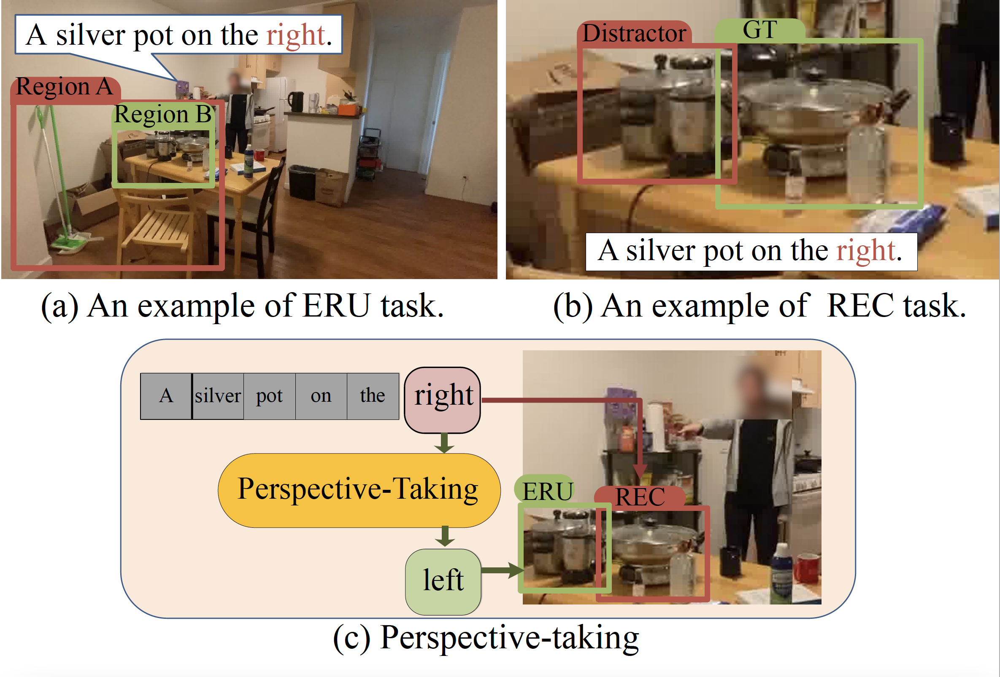
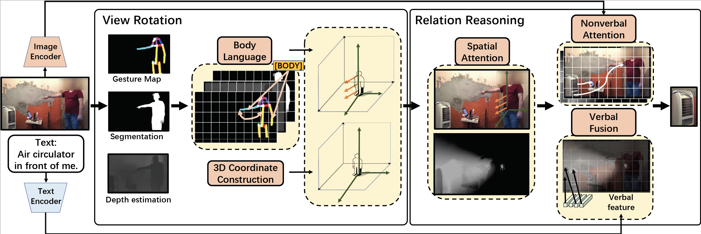

# Spatial and Visual Perspective-Taking via View Rotation and Relation Reasoning for Embodied Reference Understanding

by [Cheng Shi](https://github.com/ChengShiest/) and [Sibei Yang](https://sibeiyang.github.io/)

European Conference on Computer Vision (ECCV), 2022

## Introduction

Embodied Reference Understanding studies the reference understanding in an embodied fashion, where a receiver requires to locate a target object referred to by both language and gesture of the sender in a shared physical environment. Its main challenge lies in how to make the receiver with the egocentric view access spatial and visual information relative to the sender to judge how objects are oriented around and seen from the sender, i.e., spatial and visual perspective-taking. In this paper, we propose a REasoning from your Perspective (REP) method to tackle the challenge by modeling relations between the receiver and the sender as well as the sender and the objects via the proposed novel view rotation and relation reasoning. Specifically, view rotation first rotates the receiver to the position of the sender by constructing an embodied 3D coordinate system with the position of the sender as the origin. Then, it changes the orientation of the receiver to the orientation of the sender by encoding the body orientation and gesture of the sender. Relation reasoning models both the nonverbal and verbal relations between the sender and the objects by multi-modal cooperative reasoning in gesture, language, visual content, and spatial position.

  

## Framework

  

### Citation

    @inproceedings{shi2022spatial,
      title={Spatial and Visual Perspective-Taking via View Rotation and Relation Reasoning for Embodied Reference Understanding},
      author={Shi, Cheng and Yang, Sibei},
      booktitle={Computer Vision--ECCV 2022: 17th European Conference, Tel Aviv, Israel, October 23--27, 2022, Proceedings, Part XXXVI},
      pages={201--218},
      year={2022},
      organization={Springer}
    }

### Acknowledgement
Our code is built on [ReSC](https://github.com/zyang-ur/ReSC) and [YouRefIt](https://github.com/yixchen/YouRefIt_ERU), we thank the authors for their hard work.

